// 25 minutes + 5 minutes Q&A
:revealjs_totalTime: 1500
:revealjs_theme: serif
:revealjs_help: true

[.small]
= Can we have the{nbsp}Standard Library for{nbsp}Macros?

**Game of the Year Edition**

---

**Mateusz Kubuszok**

[NOTE.speaker]
--
Hello everyone, my name is Mateusz Kubuszok and I will be presenting about Scala, macros and if we can make them easier and more approachable to everyone.

As you can see the subtitle changed to Game of the Year Edition because after the recent developments I believe it would be underselling to show you the previous version of the presentation that I used on Scala Days and on Scala.io.
--

== About me

[%step]
 * Scala developer for almost 11 years
 * co-author and maintainer of https://chimney.readthedocs.io[Chimney] for about 9 of them
 * blogged at https://kubuszok.com[Kubuszok.com]
 * wrote https://leanpub.com/jvm-scala-book/[Things you need to know about JVM (that matter in Scala)]
 * several presentations about metaprogramming in Scala

[NOTE.speaker]
--
So let me shortly introduce myself.

I developed in Scala for almost eleven years.

For about nine of them, I was also a maintainer of the Chimney library that perhaps some of you have heard.

This gave me some insight into how macros are working and about metaprogramming in Scala in general, which resulted in several presentations, a blog post, and recently a new library.

During all that time I have also been learning about functional programming and sharing what I learned, how JVM works, how to make it performant, how to make Scala approachable to other programmers.

Basically all of the above in a slide I am copy-pasting for all my presentations, but this time it's more relevant than ever.
--

== Why macros?

**The background**

[NOTE.speaker]
--
How? Let me give you some background.
--

=== The Chimney Story

=== !

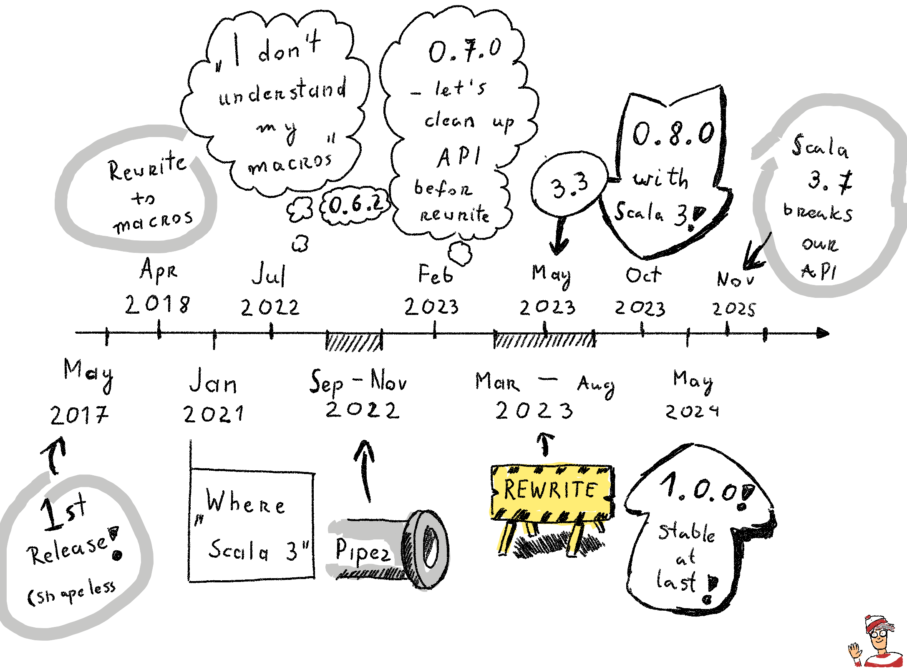

[NOTE.speaker]
--
Nine years ago, I had to solo maintain some backend service where we wanted to have a clear separation of concerns between the JSON models, database models, domain models, and converting back and forth was really tiring, which is why together with my friend Piotr Krzemiński, we kicked off Chimney.

The initial version was based on Shapeless, obviously as everything else, but very soon I ran into some very long compilation times and adding more features which were obviously needed not only by us but also by other users that appeared at the time. We learned that implementing it with Shapeless grew exponentially hard. So we rewrote the whole library to macros.

During our way we learned that macros are very rough around the edges, that you can very easily write code that is about as maintainable as a giant JavaScript blob with no types and with no hints and with no tooling. So even though on a regular basis we tried to refactor it, create some nice utilities, keep things nicely separated, after a while the development of the library slowed down to a halt.

And despite what many of you believe, it was even before Scala 3 appeared. The fact that Chimney needed something like two, maybe three years to get ported to Scala 3 was not interestingly caused by the difference between macro systems on Scala 2 and Scala 3. The issue was that even on Scala 2 we already got to the point that we the maintainers couldn't fit the whole code in our heads, we couldn't refactor it, we couldn't follow what is actually happening there.

Even excluding Scala 3 migration, we learned that we have to somehow refactor this codebase into some more typed utilities. Ones which are telling us with what we are working at every single stage, telling us the type of every single intermediate expression, something which would handle the corner cases around pattern matching or creating types with type parameters, handling AnyVals, handling implicits, recursion, etcetera.

From that point of view Scala 3 was just the straw that broke the camel's back. If we had these tools and used them consistently across the whole codebase, all we would have to do would be provide an implementation for Scala 3 and the porting of the whole library would be much easier.

We immediately discarded the possibility that we should just port it as a separate codebase because the complexity of this whole codebase was so big that we had absolutely zero confidence that if we just rewrote the code from scratch we would have any sort of behavior parity between both versions. It would be virtually a new library and quite a lot of our users were still on Scala 2.13 and 2.12 so it made no sense to have two versions of the library when changing the Scala version would also force them to rewrite how they are using Chimney because the behavior changed in basically unpredictable ways. The only way forward for us was to design in such a way that both versions have behavior parity, they could share as much tests as possible, they could share as much of the code as possible to make it aligned by design.

That was a huge effort which took about a year, year and a half, and implementing the Scala 3 version was basically a side product of this whole foundational rework of the Chimney implementation. Very early we figured out that we could have one common interface, shared by both versions of Scala that could be just used to implement the business logic so to say. While the Scala 2 and Scala 3 parts would be just implementation details. Scala 2 and Scala 3 macros would be just implementation details.

Additionally, we also researched how to make the automatic derivation with Chimney possible without using all these weird automatic versus semi-automatic split. We designed utilities to aggregate all of the errors in the macro so that the user would have full access to every single error at once so that it could be fixed in one go rather than running it again and again and again and learning of one issue at a time. We developed a way of logging what is happening inside a macro so that if you wanted to complain that you have no idea what is happening inside Chimney, you could just add a single implicit and get a whole log telling you what is happening, what kind of decisions were made inside a macro, why, which would be a huge improvement over whatever you would have in Shapeless or Mirrors based derivation. And also both of these things, much faster than Shapeless and Mirrors.

So then Chimney 0.8.0 was released and after a bit of polishing it got upgraded to Chimney 1.0.0. We believe it was a huge engineering success and for me it was an eye-opening experience that we can have much better derivation tools than basically what any other library is providing and that it's not a matter of Chimney being special, it's something that could be doable by every other library that uses type class derivation.

Then 3.7 came, and broke our automatic derivation, but we managed to convince the Scala team to add some utilities to the standard library.
--

=== What we discovered

[.small]
[%step]
 * we **can** share macros code between Scala 2 and Scala 3
 * macros are **not slow** - **abusing type checker** via implicit resolution **is**
 * macros can **aggregate errors**, and know their context - better errors
 * macros can **log their internal logic and resulting expression**
 * macros have **more opportunities to micro-optimize** the code
 * while usage of semi-auto still makes sense - **it is not required to use everywhere** at all time to keep the project maintainable - that's issue of Shapeless/Circe approach, not the type class derivation itself
 * eye-opening: we **can have much better derivation tools**
 * not a matter of Chimney being special — **doable by every library** doing type class derivation

[NOTE.speaker]
--
But these findings are so against the common knowledge, that even now half the senior developers on the audience would feel like calling me out on these.

Because everything about type class derivation has already been invented, and there is only one way to do it, right.
--

=== !

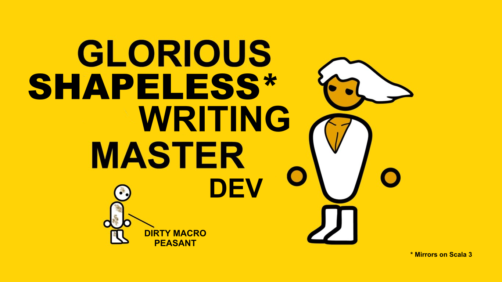

=== "Words are cheap

**Show me the code"**

[NOTE.speaker]
--
But words are cheap, show me the code. That's what everyone would ask. Everything that I'm claiming goes against the common wisdom that every single person and every single channel in the Scala community will tell you about how automatic derivation works, how semi-automatic derivation works, why automatic sucks, why it can't be fixed, why everyone who tells you otherwise is silly.
--

=== "The code" (& numbers)

=== !

[cols="1,1"]
|===
a|
[%step]
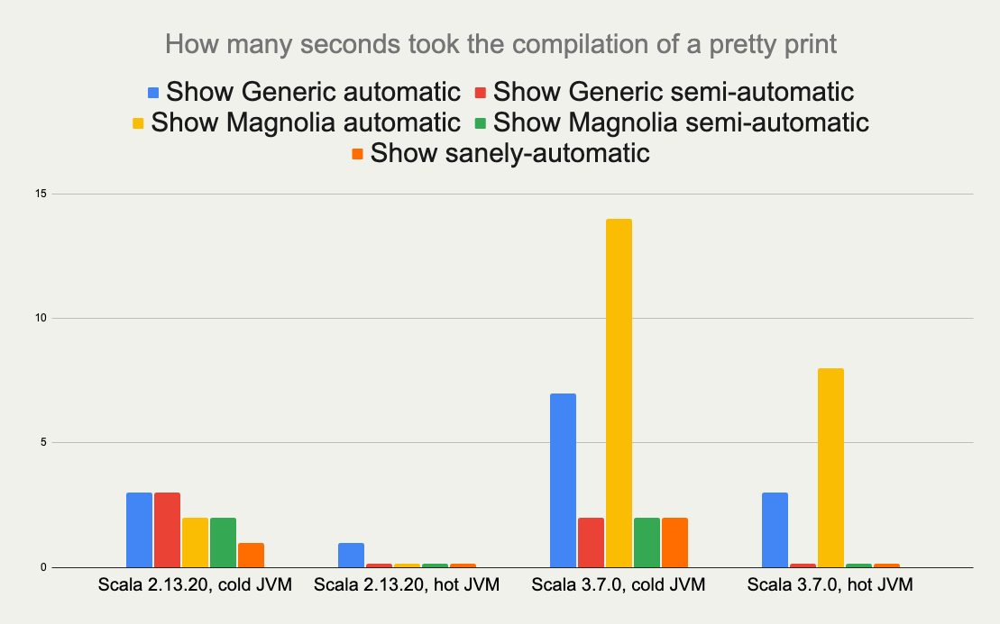
a|
[%step]
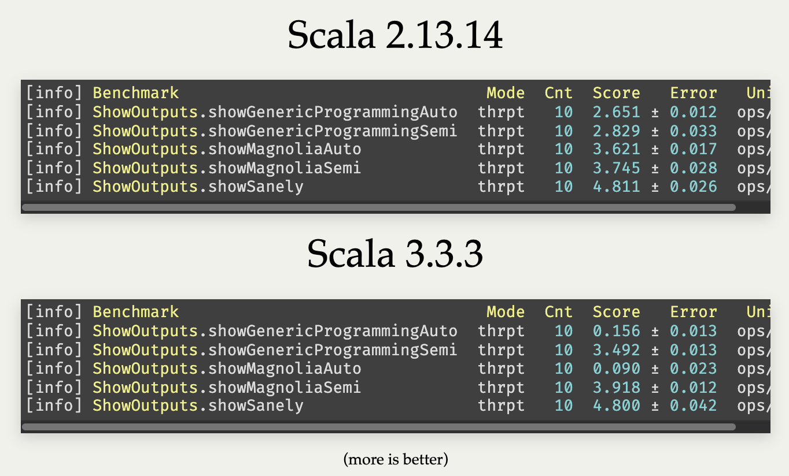
a|
[%step]
[.small]
[source]
--
implicit not found

 // vs

Failed to derive showing for value:
  example.ShowSanely.User:
No build-in support nor implicit
for type scala.Nothing
--
a|
[%step]
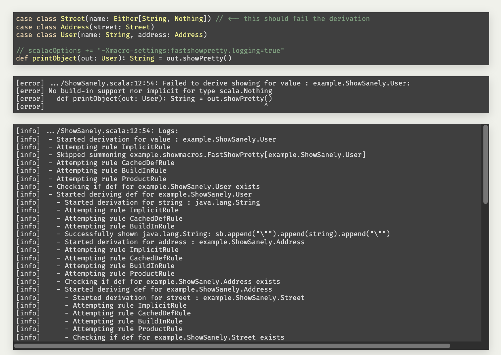
|===

[NOTE.speaker]
--
Which is why exactly a year ago I prepared a presentation showing these things.

Numbers showing you that the approach that we developed for Chimney would also work for libraries like Circe or jsoniter-scala, making the code compile much faster.

Additionally, this code would run much faster at runtime. And if anything goes wrong, you get much better error messages than what is currently available with Shapeless and Mirrors.

For users, this approach has virtually no downsides compared to what is the most common approach in the whole community right now.

And yes, I run the test later on newer versions on Scala 2 and 3, results were virtually the same.
--

=== !

[cols="1,1"]
|===
a|

https://github.com/MateuszKubuszok/derivation-benchmarks[Benchmarks]
a|

https://mateuszkubuszok.github.io/SlowAutoInconvenientSemiUpdated/[Previous presentation]
|===

=== The downside

[%step]
 * pain to implement for library authors
 * unless we make it easier, nobody would actually use this
 * Chimney's tools, though a huge improvement, have rough edges
 * not suitable for generic type class derivation as-is

[NOTE.speaker]
--
It does have a downside though. It is a pain to implement for the library implementers. And I was fully convinced that unless I would make it easier, even though everyone would look at the numbers and think, wow, this is great, nobody would actually use this.

And unfortunately the tools we have for Chimney, though I believe they're a huge improvement, have a few rough edges which would mean that they are not suitable for generic type class derivation.
--

== The horror

**Why macros suck**

[NOTE.speaker]
--
Here are some reasons why people have issues getting into macros, whether Scala 2 or Scala 3.
--

=== Learning resources

[%step]
 * virtually no sources
 * official Scala documentation is basically...

[NOTE.speaker]
--
There are virtually no sources. Even though you can find a few blog posts about it or even though there is official Scala documentation, it's basically like the meme that everyone knows.
--

=== !

[NOTE.speaker]
--
"Here, draw two circles, now draw the rest of the fluffy owl."

So you can only learn how to write macros by actually writing macros, which is a pain. You write some expression, you print it, you assume okay this is the AST I have to build, then you try to reproduce it. At this point it sounds easy until you learn that actually a tiny little change to what you're trying to build generates a completely different expression with a completely different AST, so you would have to write a lot of samples to figure out about a lot of these tiny little details that you would have to consider when building this AST and this is a never-ending fun.
--

=== Some examples

=== Quoting and Splicing

[%step]
[cols="1,1"]
|===
| Scala 2 (Quasiquotes)
| Scala 3 (Quotes)
a|
[source, scala]
--
// using Quotes
val expr1 =
  c.Expr[Int](q"21")
val expr2 =
  c.Expr[Int](q"37")

val expr3 = c.Expr[Int](
  q"""
  ${ expr1 } + ${ expr2 }
  """
)
--
a|
[source, scala]
--
// using Quotes
val expr1 = Expr(21)
val expr2 = Expr(37)

val expr3 = '{
  ${ expr1 } + ${ expr2 }
}
--
|===

[NOTE.speaker]
--
On Scala 2, if we want to use types, we are very verbose.

Types are not inferred, and we have to use `c.WeakTypeTag` and `c.Expr` to get them.

Quasiquotes are basically compile-time-checked string interpolation,
so even though they are powerful and usually safe,
we have no syntax highlighting, nor IntelliSense when writing them.

On Scala 3, we have some actual quotes, which work better with IDE.

So, this looks like an issue only for Scala 2.
--

=== Matching Types

[%step]
[.small]
[cols="1,1"]
|===
| Scala 2 (Quasiquotes)
| Scala 3 (Quotes)
a|
[source, scala]
--
def whenOptionOf[A:c.WeakTypeTag] =...

weakTypeOf[A]
 .dealias
 .widen
 .baseType(
  c.mirror.staticClass("scala.Option")
 ) match {
  case TypeRef(_, _, List(t)) =>
    whenOptionOf(
      c.WeakTypeTag(t.dealias.widen)
    )
  case _ => ...
}
--
a|
[source, scala]
--
def whenOptionOf[A: Type] = ...

Type.of[A] match {
  case '[Option[t]] =>
    whenOptionOf[t]
  case _ => ...
}
--
|===

[NOTE.speaker]
--
We want to pattern match on types. Is the type `A` an example of an `Option`?
We also want to handle cases like `None`.

The Scala 2 snippet barely fit in the table.

Scala 3 is quite easy to read.
--

=== Instantiating an{nbsp}Arbitrary Type

[%step]
[cols="1,1"]
|===
| Scala 2 (Quasiquotes)
| Scala 3 (Quotes)
a|
[source, scala]
--
val args:List[List[c.Tree]]=
  ...

c.Expr[A](
  q"""
  new ${weakTypeOf[A]}(
    ...${args}
  )
  """
)
--
a|
[source, scala]
--
val ctor = TypeRepr.of[A]
  .typeSymbol
  .primaryConstructor

val args: List[List[Tree]] =
  ...

New(TypeTree.of[A])
  .select(ctor)
  .appliedToArgss(args)
--
|===

[NOTE.speaker]
--
Scala 2 is not perfect, we're gluing untyped `Tree`s, but at least it's consistent.

Scala 3, allows quoting and splicing, but only for whole expressions. Pieces that would build an expression have to be combined manually.
--

[.small-h2]
=== Constructing a Pattern Match

[%step]
[.small]
[cols="1,1"]
|===
| Scala 2 (Quasiquotes)
| Scala 3 (Quotes)
a|
[source, scala]
--
def handleCase[
  A: c.WeakTypeTag
](name: c.Expr[A]) = ...
--

[source, scala]
--
/* for each case: */
val name = c.internal
  .reificationSupport
  .freshTermName("a")
cq"""
$name: ${weakTypeOf[A]} =>
  ${handleCase(c.Expr[A](q"$name"))}
"""
--

[source, scala]
--
/* then create the match: */
c.Expr[Result](
  q"""
  $expr match { ...${cases} }
  """
)
--
a|
[source, scala]
--
def handleCase[
  A: Type
](name: Expr[A]) = ...
--

[source, scala]
--
/* for each case: */
val name = Symbol.newBind(
  Symbol.spliceOwner,
  Symbol.freshName("a"),
  Flags.Empty,
  TypeRepr.of[A]
)
CaseDef(
  Bind(
    name,
    Typed(Wildcard(),TypeTree.of[A])),
  None,
  handleCase(Ref(name).asExprOf[A]))
--

[source, scala]
--
Match(expr.asTerm, cases)
  .asExprOf[Result]
--
|===

[NOTE.speaker]
--
Scala 2, again, not perfect, but consistent. We can actually read the code and understand what's going on.

Scala 3, we can get easily lost with the details.

And, these are not even bullet-proof:
for some cases such match would work, but for some it would not,
so we would have to write multiple versions and check which applies.
--

=== Sealed Trait's Children

[%step]
[.small]
[cols="1,1"]
|===
| Scala 2 (Quasiquotes)
| Scala 3 (Quotes)
a|
[source, scala]
--
val symbol = c.weakTypeOf[A]
  .typeSymbol
if (symbol.isSealed) {
  // force Symbol initialization
  symbol.typeSignature
  val children = symbol.asClass
    .knownDirectSubclasses.map{sym =>
      val sEta = sym.asType
        .toType.etaExpand
      sEta.finalResultType
          .substituteTypes(
        sEta.baseType(symbol)
          .typeArgs.map(_.typeSymbol),
        c.weakTypeOf[A].typeArgs
      )
    }
  ...
} else {
  ...
}
--
a|
[source, scala]
--
val A = TypeRepr.of[A]
val sym = A.typeSymbol
if (sym.flags.is(Flags.Sealed)) {
  val c = sym.children.map: sub =>
    sub.primaryConstructor
        .paramSymss match:
      // manually reapply type params
      case syms :: _
      if syms.exists(_.isType) =>
        val param2tpe = sub.typeRef
          .baseType(sym).typeArgs
          .map(_.typeSymbol.name)
          .zip(A.typeArgs).toMap
        val types = syms.map(_.name)
          .map(param2tpe)
        sub.typeRef.appliedTo(types)
      // subtype is monomorphic
      case _ => sub.typeRef
  ...
} else { ... }
--
|===

[NOTE.speaker]
--
As you can see, this is programming code which we could also consider ASCII art. We could put it in some museum of modern art, not necessarily something we would like to read and write and maintain.
--

=== Jackson Pollock

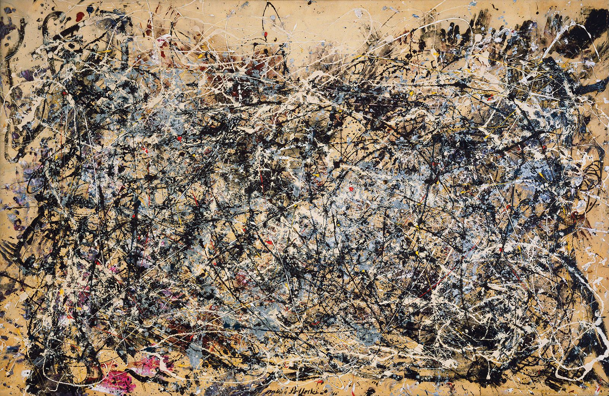

(Not a macro, but looks very similar)

[NOTE.speaker]
--
Perhaps with LLMs we might try, but still to get it right you would have to tell the LLM to write something like a gazillion examples and then generate the code for all of them and then check if it compiles and then if it runs and if it does exactly the thing you want. So even if you have an AI doing it for you, you could still spend several weeks, maybe months to get it right just because every single new use case would be something completely unexpected.

Even with AI it would be much easier if we had some sane API which has some well-defined behavior and the AI just needs to use it instead of guessing what else needs to be handled.
--

== The dream

**Let's imagine such an API**

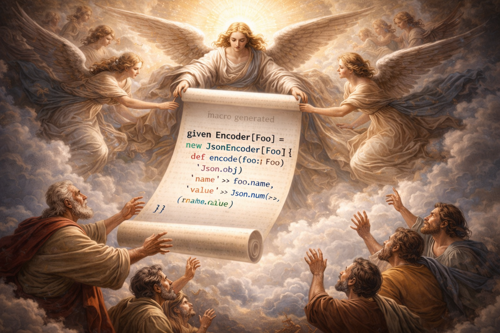

=== Macro IO

[source, scala]
--
val a = MIO {
  21
}
val b = MIO {
  37
}

a.map2(b)(_ + _) // applicative syntax
--

[source, scala]
--
for {
  i <- MIO(1)
  j <- MIO(2)
} yield i + j // monadic syntax
--

[source, scala]
--
List("1", "2", "3", "a", "b").parTraverse { a =>
  MIO(a.toInt)
} // .par* aggregates errors
--

[NOTE.speaker]
--
First of all, let's imagine that we can use an `IO`-like data type.

It's lazy, non-memoizable, stack-safe, and has all the nice utilities that we expect from `IO`.

It is, of course, completely optional. But if you're into it, then logging would also be easy.
--

=== Logging

[source, scala]
--
Log.namedScope("All logs here will share the same span") {
  Log.info("Some operation starting") >> // standalone log

    MIO("some operation")
      .log.info("Some operation ended") >> // log after IO

    Log.namedScope("Spans can be nested") {
      Log.info("Nested log") // we can nest as much as we want
    }
}
--

[source]
--
All logs here will share the same span:
├ [Info]  Some operation starting
├ [Info]  Some operation ended
└ Spans can be nested:
  └ [Info]  Nested log
--

[NOTE.speaker]
--
We could imagine that we can treat logging as an MIO effect.

And since we might decide to use spans, to give it some structure.
--

=== Let's assume that it can be a thing

[source, scala]
--
// Yet another utility, because .map/.flatMap
// cannot handle this:
MIO.scoped { runSafe =>

  Expr.quote { // <- instead of '{}/ q"..."
    new Show[A] {

     def show(a: A): String = Expr.splice {// <- instead of ${}
        runSafe {
          deriveShowBody(Expr.quote{ a })// : MIO[Expr[String]]
        } // : Expr[String]
      }
    }
  } // : Expr[Show[A]]
} // : MIO[Expr[Show[A]]]
--

[NOTE.speaker]
--
Syntaxes for Quotes and Quasiquotes seem like something that cannot be reconciled.
But let us imagine that they can.

Let us also imagine, that we have such a "direct style" available to us. Because
we can easily come up with situations, where it would be more convenient than monadic API.
Or where monadic API would be simply impossible.
--

=== And this as well:

[source, scala]
--
val OptionType = Type.Ctor1.of[Option]
val EitherType = Type.Ctor2.of[Either]

Type[A] match {
  case OptionType(a) =>
    ... // a is A in Option[A]
  case EitherType(l, r) =>
    ... // l is L and r is R in Either[L, R]
  case _ =>
    ... // A is not an Option or Either
}
--

[NOTE.speaker]
--
Let us imagine this is also possible - we create a utility for applying and unapplying
type parameters from the type, and it just works on both versions of Scala.
--

=== Imagine you created instances like this:

[.small]
[source, scala]
--
CaseClass.parse[A] match {
  case Some(caseClass) =>
   // A(summon[Arg1], summon[Arg2], ...)
   caseClass.construct { parameter =>
      import parameter.tpe.Underlying as Param // <- giving existential type a name!

      Expr.summonImplicit[Param] match {
        case Some(expr) => MIO.pure(expr)

        case None => MIO.fail(
          new Exception(s"No implicit for ${Type.prettyPrint[Param]}")
        )
      }
   }

  case None => MIO.fail(
    new Exception(s"Not a case class: ${Type.prettyPrint[A]}")
  )
} // : MIO[Expr[A]]
--

[NOTE.speaker]
--
Let us also imagine that we have a Magnolia-like API but in the macro,
so creating a new instance would be much easier, and more high-level.
--

=== And pattern-matched like this:

[.small]
[source, scala]
--
Enum.parse[A] match {
  case Some(enumm) =>
    // expr match {
    //   case b: B => "B" + " : " + b.toString
    //   ...
    // }
    enumm.matchOn(expr) { matchedSubtype =>
      import matchedSubtype.{Underlying as B, value as b}
      // B <- named existential type
      // b: Expr[B]
      val bName = Expr(B.simpleName) // Expr[String]
      MIO {
        Expr.quote {
          Expr.splice { bName } + " : " + Expr.splice { b }.toString
        }
      }
    }

  case None => MIO.pure(Expr("not an enum"))
} // : MIO[Expr[String]]
--

[NOTE.speaker]
--
And similarly for enums, we can just get all of the subtypes with type parameters applied
that we could just pattern-match.
--

=== And handled collections like this:

[.small]
[source, scala]
--
val expr: Expr[A] = ...

Type[A] match {
  case IsCollection(isCollection) =>
    import isCollection.{ Underlying as Item, value => isCollectionOfItem }
    // Now we can use `Item` as the type of the collection elements

    val iterable: Expr[Iterable[Item]] = isCollectionOfItem.asIterable(expr)
    Expr.quote {
      Expr.splice(iterable).map { (item: Item) => ... } // Type[Item] is handled
    }
  case _ => ...
}
--

[NOTE.speaker]
--
How about collections? Well we could assume that we are using an expression of something that is iterable and then iterate over it because you know, we would like to handle all of them, not just handle every single collection in separation. So let's come up with an API to handle every single collection at once.

You know what, since we already have this API it would be nice if it would also somehow smartly learn how to deal with your collections. You could give it some extension and it would learn how to deal with, I don't know, a NonEmptyList from Cats? How about Java collections?
--

=== And value classes like this:

[.small]
[source, scala]
--
val outer: Expr[A] = ...

Type[A] match {
  case IsValueType(isValueType) =>
    import isValueType.{ Underlying as Inner, value => outerIsValueType }
    // Now we can use Inner as the value class's underlying type

    val unwrapped: Expr[Inner] = outerIsValueType.unwrap(outer)
    outerIsValueType.wrap match {
      case CtorLikeOf.PlainValue(ctor, _) =>
        ctor(unwrapped) // <-- wrapped again, not really useful but possible
      case _ => // other constructors
    }
  case _ => ...
}
--

[NOTE.speaker]
--
What if we did this also for value classes? Maybe we could come up with an API like this when we are deriving code which is familiar with how to work with NonEmptyLists, how to wrap and unwrap these refined types, how to work with other built-in types, and it learns all of that without us importing a gazillion implicits.
--

=== And integrated external libraries like this:

[.small]
[source, scala]
--
import cats.data.NonEmptyList
import eu.timepit.refined.Refined
import eu.timepit.refined.collection.NonEmpty
import eu.timepit.refined.numeric.Positive

case class WithNEL(values: NonEmptyList[Int])
case class RefinedPerson(
  name: String Refined NonEmpty,
  age: Int Refined Positive
)
--

[.small]
[source, scala]
--
import hearth.kindling.circederivation._
// No imports for derivation needed! Just add the integration as dependency.

// These just work — encoding, decoding, validation:
KindlingsEncoder.encode(WithNEL(NonEmptyList.of(1, 2, 3)))
// => {"values": [1, 2, 3]}

KindlingsDecoder.decode[WithNEL](Json.obj("values" -> Json.arr()))
// => Left(...) — rejects empty NonEmptyList!

KindlingsDecoder.decode[Int Refined Positive](Json.fromInt(-1))
// => Left(...) — validates the predicate!
--

[NOTE.speaker]
--
You know what, since we already have this API it would be nice if it could also somehow smartly learn how to deal with your collections. You could give it some extension and it would learn how to deal with, I don't know, a NonEmptyList from Cats? How about Java collections? How about refined types?

And the answer is: yes. You just add an integration dependency and it just works. No special imports, no implicits to summon. The extension mechanism registers providers at compile time that teach the macro how to handle these types — how to iterate over a NonEmptyList, how to validate a refined predicate, how to unwrap and rewrap.
--

=== And debugged it like this:

[.small]
[source, scala]
--
// Put outside of companion to prevent auto-summoning!
implicit val logDerivation: Show.LogDerivation = Show.LogDerivation
--

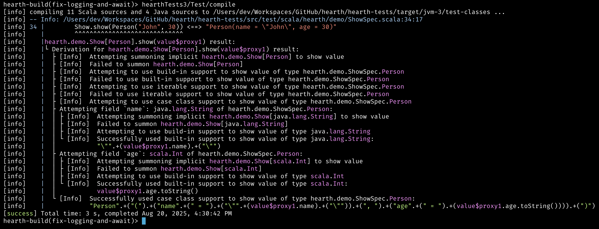

[NOTE.speaker]
--
If it's surprising to you, what if you were able to easily debug this? Because you could just slap an implicit and see the whole derivation logic, which would be much better debugging capacity than what Mirrors or Shapeless would give you.
--

=== And traced it like this:

[.smaller]
[source, scala]
--
Test / scalacOptions ++= Seq(
  "-Xmacro-settings:hearth.mioBenchmarkScopes=true",
  s"-Xmacro-settings:hearth.mioBenchmarkFlameGraphDir=${crossTarget.value / "flame-graphs"}"
)
--

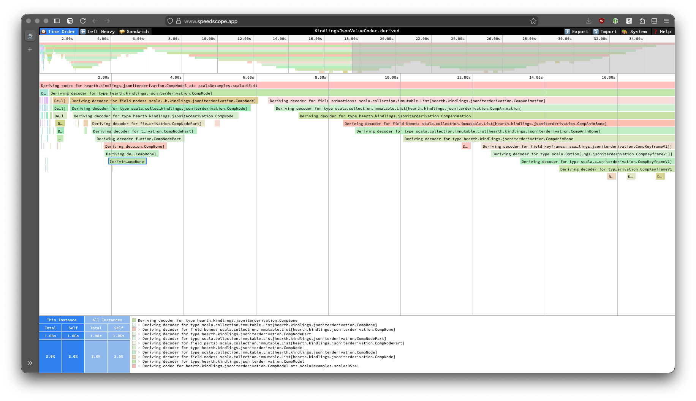

[NOTE.speaker]
--
And what if you could also instrument your macros? Get a flame graph of where compilation time is spent, trace which rules are being evaluated, see the performance profile of your macro expansion?
--

=== !

=== !

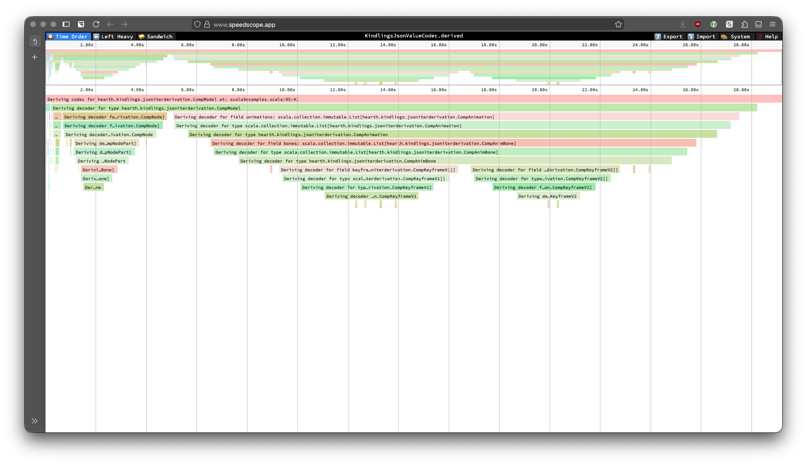

=== !

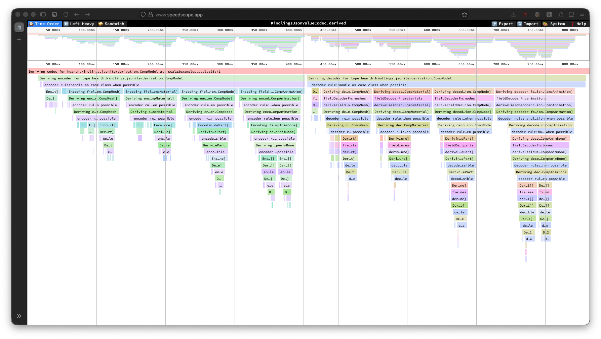

=== Actually, it's already possible

with **Hearth**

== Hearth

[cols="1,1"]
|===
a|

https://github.com/kubuszok/hearth[github.com/kubuszok/hearth]
a|
[.smaller]
[%step]
 * cross-compilable macros: Scala 2.13 & 3
 * including Cross-Quotes: `Expr.quote` / `Expr.splice` working on both Scala versions
 * high-level APIs like: `CaseClass`, `Enum`, `IsCollection`, `IsValueType`, ...
 * `MIO` monad for laziness, structured logging and error aggregation
 * and flame graphs to give your macros observability and performance insights

|===

[NOTE.speaker]
--
I believe so far you might be believing that these are some either purely academic discussions or some demo examples for something that would probably only work for a single type class, which is specifically built to handle a case like this, which is you know, a good demo or a promise of something that could be done but probably we are many years before we could actually apply it to the libraries that we are already using in the community.

So let me introduce you to Hearth, the library doing exactly all of the things that I just showed you. At this point we are virtually ready to make a release 0.3.0.

Hearth aims to make it simpler to write macros.

Even if making it easier requires expanding macros in macros,
or using a dedicated compiler plugin that works on untyped trees.
--

== Kindlings

**The incubator for Hearth-based libraries**

[cols="1,1"]
|===
a|

https://github.com/kubuszok/kindlings[github.com/kubuszok/kindlings]
a|
[%step]
 * my ShowPretty
 * Circe, Jsoniter Scala
 * scala-xml, scala-yaml
 * my UBJson
 * my Avro4s port
 * Tapir Schema
 * Cats' Kittens
|===

[NOTE.speaker]
--
And if you were worried who is actually using this thing — let me also introduce you to Kindlings, the incubator for Hearth-based libraries.

Sure, I have there a simple Show type class, which was the first type class I tested this library on.

But then I also ported Circe derivation into my sanely-automatic derivation approach: so with Kindlings you would be able to derive encoders and decoders for Circe. Both automatic and semi-automatic with virtually all of the features supported by circe-generic-extras on both Scala 2 and Scala 3 with the exactly same API. Probably faster than what Circe is doing right now. Probably it will also run faster, almost certainly with better error messages.

Also for my own amusement I ported jsoniter-scala to this approach. I added a few utilities that I liked like JSON AST that is not pulling the whole Cats ecosystem if you only want to use jsoniter, some extension methods allowing you to invariant-map over it, etcetera.

For my amusement I also generated type class derivation for scala-xml, scala-yaml, added my own UBJson library, ported avro4s.
--

=== Circe derivation

[.small]
[%step]
 * `Encoder[A]`, `Decoder[A]`, `Codec.AsObject[A]`
 * all `circe-generic-extras` features on Scala 2 *and* Scala 3
 * unified API across Scala versions
 * value class unwrapping (broken in upstream Scala 3)
 * recursive types without `Lazy` wrappers
 * `@fieldName` annotation on both Scala 2 and 3 (upstream: Scala 2 only)
 * JVM + JS + Native

=== Jsoniter-Scala derivation

[.small]
[%step]
 * `JsonValueCodec[A]`, `JsonCodec[A]`, `JsonKeyCodec[A]`
 * virtually all `JsonCodecMaker` configuration options
 * unified API across Scala versions
 * recursive types without special flags
 * JVM + JS + Native

=== Tapir Schema derivation

[%step]
 * reuses your Circe or jsoniter-scala configuration
 * schema always matches your codecs
 * correct generic type parameter names

[%step]
[.small]
[source, scala]
--
// Your Tapir schema automatically matches your JSON codec config
def schema[A: Schema]: Schema[Foo[A]] = Schema.derived
// schema[String] will be named Foo[String] instead of Foo[A]!
--

[%step]
 * no more config drift between schema and codec

[NOTE.speaker]
--
I also derive Tapir schema derivation, which is reusing your jsoniter-scala or your Circe configuration to make sure that your Tapir schema is exactly matching your codecs, and which is handling the correct names of the generic types.
--

=== Cats' Kittens port

And if you think it's still too limited to prove anything useful beyond encoders and decoders...

=== !

[.smaller]
[cols="1,1"]
|===
| Monomorphic (kind `*`)
| Polymorphic (kind `* -> *`)
a|
[%step]
 * `Show`, `Eq`, `Order`
 * `PartialOrder`, `Hash`
 * `Semigroup`, `Monoid`
 * `CommutativeSemigroup`
 * `CommutativeMonoid`
 * `alleycats.Empty`
a|
[%step]
 * `Functor`, `Contravariant`, `Invariant`
 * `Apply`, `Applicative`
 * `Foldable`, `Traverse`
 * `Reducible`, `NonEmptyTraverse`
 * `SemigroupK`, `MonoidK`
 * `alleycats.Pure`, `alleycats.EmptyK`
 * `NonEmptyAlternative` *(new!)*
 * `Alternative` *(new!)*
 * `alleycats.ConsK` *(fixed on Scala 3!)*
|===

[NOTE.speaker]
--
I also ported the whole Cats Kittens library.

Reminder, all of these sharing the type class derivation logic, sharing the unit tests, having the exact same API on Scala 2.13 and on Scala 3. You could just use them on Scala 2.13 instead of whatever you're using right now. And then when you want to migrate to Scala 3, this library is not a blocker.
--

=== All of this...

[%step]
 * sharing the type class derivation logic
 * sharing the unit tests
 * exact same API on Scala 2.13 and Scala 3
 * use them today on Scala 2.13 — migration to Scala 3 is not a blocker

== The secret weapon

**AI-assisted development**

[NOTE.speaker]
--
Sure. I believe there will be some bugs I would have to fix, but considering what comes next...
--

=== !

[%step]
 * virtually every single one of these libraries was completely vibe-coded
 * over *one week*
 * using Claude Code to implement all of it
 * a single person, one week, if really dedicated

[NOTE.speaker]
--
Considering that virtually every single one of these libraries was completely vibe-coded over one week with me just running Claude Code to implement all of this. I think it's quite promising to show that the libraries that you have to wait several years to develop, to get polished, etc. could be migrated to this better derivation approach by a single person over one week if they're really dedicated.
--

=== !

[%step]
 * libraries that took years to develop — ported in days
 * a lot of tokens burned, then *bam* — everyone benefits
 * the API is sane enough that AI can use it effectively
 * this is empowering for the community

[NOTE.speaker]
--
I believe that's quite empowering to the community that we would be able to give ourselves much better user experience even if we just offload everything to AI. We would be burning tokens like crazy but it would be a single time event. A lot of tokens burned, then bam, you have a library, everyone uses it, everyone benefits from it.
--

== Summary

=== !

[%step]
 * macros can be *better* for users than Shapeless/Mirrors
 * Hearth makes macros *approachable* for library authors
 * Kindlings *proves* it works across many real-world libraries
 * AI makes the development *fast*
 * we can give ourselves better tools — today

[NOTE.speaker]
--
I hope that I managed to show why good macros could be a better alternative to Shapeless, Mirrors, and other approaches.

I also hope I managed to explain why currently, they are not so easy to use.

Finally, I hope that I proved to you that we can make macros sane. That the result could be easy to understand and debug. That it is in our reach to replace the alternatives with something that compiles faster, and runs faster.

And that with AI assistance, this is no longer a theoretical possibility — it's something a single person can do in a week.
--

== Thank you

[cols="1,1"]
|===
a|

https://scala-hearth.readthedocs.io[Hearth]
a|

https://github.com/kubuszok/kindlings[Kindlings]
|===
